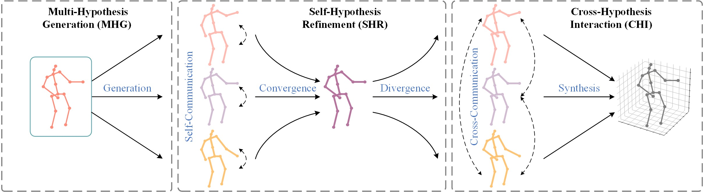

# MHFormer: Multi-Hypothesis Transformer for 3D Human Pose Estimation [CVPR 2022]

<p align="center"></p>

> [**MHFormer: Multi-Hypothesis Transformer for 3D Human Pose Estimation**](https://arxiv.org/pdf/2111.12707),            
> Wenhao Li, Hong Liu, Hao Tang, Pichao Wang, Luc Van Gool,        
> *In Conference on Computer Vision and Pattern Recognition (CVPR), 2022*

<p float="left">
  
  

## Dependencies

- Cuda 11.1
- Python 3.6
- Pytorch 1.7.1

## Dataset setup

Please download the dataset from [Human3.6M](http://vision.imar.ro/human3.6m/) website and refer to [VideoPose3D](https://github.com/facebookresearch/VideoPose3D) to set up the Human3.6M dataset ('./dataset' directory). 

```bash
${POSE_ROOT}/
|-- dataset
|   |-- data_3d_h36m.npz
|   |-- data_2d_h36m_cpn_ft_h36m_dbb.npz
```

## Download pretrained model

The pretrained model can be found in [Google_Drive](https://drive.google.com/drive/folders/19yIV-XzdtAYZQ2gQsZQyN844lzlTlToa?usp=sharing), please download it and put in the './checkpoint' dictory. 

## Test the model

To test on pretrained model on Human3.6M:

```bash
python main.py --reload --previous_dir 'checkpoint/pretrained'
```

Here, we compare our MHFormer with recent state-of-the-art methods on Human3.6M dataset. Evaluation metric is Mean Per Joint Position Error (MPJPE) in mm​. 


|   Models    |  MPJPE   |
| :---------: | :------: |
| VideoPose3D |   46.8   |
| PoseFormer  |   44.3   |
|  MHFormer   | **43.0** |


## Train the model

To train on Human3.6M:

```bash
python main.py --train
```

## Citation

If you find our work useful in your research, please consider citing:

    @inproceedings{li2022mhformer,
      title={MHFormer: Multi-Hypothesis Transformer for 3D Human Pose Estimation},
      author={Li, Wenhao and Liu, Hong and Tang, Hao and Wang, Pichao and Van Gool, Luc},
      booktitle={Proceedings of the IEEE Conference on Computer Vision and Pattern Recognition (CVPR)},
      year={2022}
    }

## Acknowledgement

Our code is extended from the following repositories. We thank the authors for releasing the codes. 

- [3d-pose-baseline](https://github.com/una-dinosauria/3d-pose-baseline)
- [3d_pose_baseline_pytorch](https://github.com/weigq/3d_pose_baseline_pytorch)
- [VideoPose3D](https://github.com/facebookresearch/VideoPose3D)
- [ST-GCN](https://github.com/vanoracai/Exploiting-Spatial-temporal-Relationships-for-3D-Pose-Estimation-via-Graph-Convolutional-Networks)

## Licence

This project is licensed under the terms of the MIT license.
